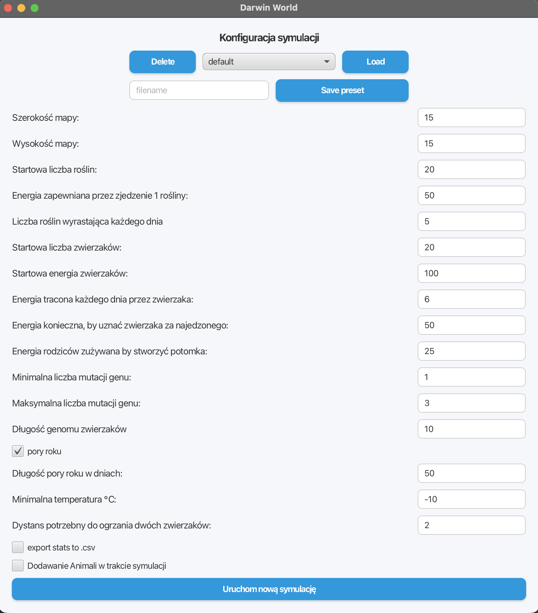

# Darwin World

**Object-Oriented Programming** course project — AGH University of Science and Technology, 2025.  
Authors: Bartosz Gryn, Janusz 

An evolution simulation — animals roam a map, eat plants, reproduce, and evolve through genome mutations.

---

## Demo

### Configuration Screen



### Simulation Demo

docs/simulation_demo.mp4

The video shows a running simulation with multiple windows open simultaneously, the live statistics chart, energy bars on animals, seasonal map coloring (summer/winter), and step-by-step rewind.

---

## Tech Stack

- **Java 21**
- **JavaFX 21** — GUI, Canvas rendering, LineChart, FXML
- **Gradle 8** — build tool
- **JUnit 5** — unit tests

---

## Running the Project

```bash
./gradlew run
```

Requires Java 21 with JavaFX support.

---

## Project Architecture

```
src/main/java/agh/ics/oop/
├── model/
│   ├── animal/           # Animals, genome, components (energy, life, reproduction)
│   ├── map/              # World map (standard and seasonal), statistics
│   │   └── utils/        # Plant generator, animal map, energy percentiles
│   ├── simulation/       # Simulation loop, config, step history
│   └── filesystem/       # Preset save/load, CSV export, history file handler
├── presenter/            # MVP presenters: main window, simulation, animal stats
└── view/                 # MapRenderer (canvas drawing), SimulationApp, SimulationLauncher
```

The project follows the **MVP** (Model-View-Presenter) pattern — simulation logic is fully decoupled from JavaFX. The simulation runs on a dedicated background thread; UI updates are dispatched to the JavaFX thread via `Platform.runLater`.

---

## Simulation Rules

Each simulation day proceeds in a fixed sequence:

1. Remove dead animals
2. Rotate and move every animal (according to its active gene)
3. Animals that stepped on a plant eat it
4. Fed animals on the same tile reproduce
5. Each animal loses energy
6. New plants grow (80% chance in the jungle — the equatorial strip covering 20% of the map height)
7. End-of-day processing (e.g. season change)

### Animals

Each animal has: position, orientation (8 cardinal directions), energy, and a **genome** — a list of N integers in range 0–7. Each day the active gene rotates the animal; the pointer then advances cyclically to the next gene.

### Reproduction

Two animals on the same tile reproduce if both have energy ≥ `energyToReproduce`. Each parent loses `energyToKid` energy — that combined amount becomes the offspring's starting energy. The offspring inherits genome segments from both parents proportionally to their energy (stronger parent contributes more). After crossover, a random number of genes (in range `minMutations–maxMutations`) are mutated to random new values.

### Map Topology

The map wraps horizontally (left edge connects to right edge). The top and bottom edges act as poles — animals bounce off them, reversing their movement direction.

---

## Seasons

The simulation can be run in **seasonal mode** (toggle the "pory roku" checkbox in the configuration screen).

### Summer

- Plants grow **1.5× more often** (plant count multiplier).
- Eating a plant provides **1.5× more energy**.
- Energy loss per day = baseline (1×).

### Winter

- Plants grow at baseline frequency and provide baseline energy.
- Temperature drops gradually from the summer value (30 °C) down to `minTemperature`, then rises symmetrically back — reaching summer temperature exactly at the end of winter.
- Each animal's energy loss is scaled by temperature: the colder it is, the higher the multiplier (up to 2×).
- **Warmth mechanic**: an animal with at least one neighbour within distance ≤ `distanceRequiredToHeat` loses energy at the baseline rate (1×), regardless of temperature.

### Seasonal Parameters

| Parameter | Description |
|---|---|
| `seasonLength` | Length of each season in days |
| `minTemperature` | Minimum temperature at the coldest point of winter (°C) |
| `distanceRequiredToHeat` | Distance within which another animal provides warmth |

---

## Core Features

- **Simulation configuration** via GUI — all parameters are editable in the startup window.
- **Multiple simultaneous simulations** — each launch opens a new, independent window.
- **Map animation** — animals and plants rendered on a JavaFX `Canvas`. Animals have directional sprites (8 images for 8 orientations). Map background changes colour between summer and winter palettes.
- **Pause and resume** — dedicated Start / Pause buttons.
- **Live statistics** (updated every day): animal count, plant count, free tile count, most popular genotype, average energy, average lifespan of dead animals, average number of children of living animals.

---

## Extensions

### Running multiple simulations simultaneously
Every click of "Uruchom nową symulację" opens a separate window with its own independent simulation instance running in its own thread.

### Energy visualisation
An energy bar is drawn below each animal. Its colour is determined by the animal's energy percentile among all currently living animals — from red (low energy) through yellow to green (high energy).

### Saving and loading configuration presets
Configurations are stored as `.properties` files in the `config/` folder. The UI offers a dropdown list of saved presets with Load, Delete, and Save buttons. The project ships with a `default` preset and several example presets (e.g. `lato`, `duza mapa i mroz`).

### Inspecting individual animal statistics
While the simulation is paused, clicking any animal on the map opens a live-updating stats window showing:

- Full genome
- Currently active gene (index and value)
- Current energy
- Number of plants eaten
- Number of direct children
- Total number of descendants (including indirect)
- Number of days lived
- Day of death (if the animal has died)

### Visual highlighting of the dominant genotype and preferred plant positions
Animals carrying the most popular genotype are marked with a semi-transparent purple halo behind their sprite. Jungle tiles (preferred plant growth zones) are shown with a distinct background shade.

### CSV statistics export
Enabling "export stats to .csv" in the configuration window activates per-day CSV logging. The file is written to the user's home directory and includes the columns: `Day, animalsCount, plantsCount, freeFieldsCount, averageEnergy, averageLifespan, averageChildren, mostPopularGenotype`. The file opens directly in Excel for visualisation.

### Live statistics chart
The simulation window contains a live `LineChart` updated every day. Checkboxes let the user toggle individual series: animal count, plant count, free tiles, average energy, average lifespan, average children count.

### Step-by-step rewind (forward and backward)
While paused, the ← and → buttons step through the simulation history. State per day (animals and plants) is serialised to disk via `HistoryFileHandler`; per-day statistics are kept in memory by `SimulationHistory`.

### Adding animals at runtime
Enabling "Dodawanie Animali w trakcie symulacji" in the configuration unlocks a checkbox in the simulation window. When checked and the simulation is paused, clicking any tile spawns a new animal with default parameters at that position.

---

## Tests

Unit tests in `src/test/` cover:

- `GenTest` — genome creation, iteration, crossover, mutations
- `AnimalTest` — movement, rotation, reproduction logic
- `RealWorldMapTest` — map behaviour, edge cases at boundaries
- `SeasonalWorldMapTest` — season transitions, warming mechanic, energy multipliers

```bash
./gradlew test
```

---

## Configuration Parameters

| Parameter | Description |
|---|---|
| `mapWidth` / `mapHeight` | Map dimensions |
| `startPlantCount` | Initial number of plants |
| `energyFromPlant` | Energy gained from eating one plant (baseline) |
| `plantsPerDay` | New plants grown per day (baseline) |
| `startAnimalCount` | Initial number of animals |
| `startAnimalEnergy` | Starting energy for each animal |
| `energyLossPerDay` | Energy lost per day (baseline) |
| `energyToReproduce` | Minimum energy required to reproduce |
| `energyToKid` | Energy each parent transfers to the offspring |
| `minMutations` / `maxMutations` | Range for the number of genome mutations in offspring |
| `genomeLength` | Length of each animal's genome |
| `isSeasonal` | Enable seasons variant (Variant B) |
| `seasonLength` | Duration of each season in days |
| `minTemperature` | Minimum temperature during winter (°C) |
| `distanceRequiredToHeat` | Warmth radius between animals in winter |
